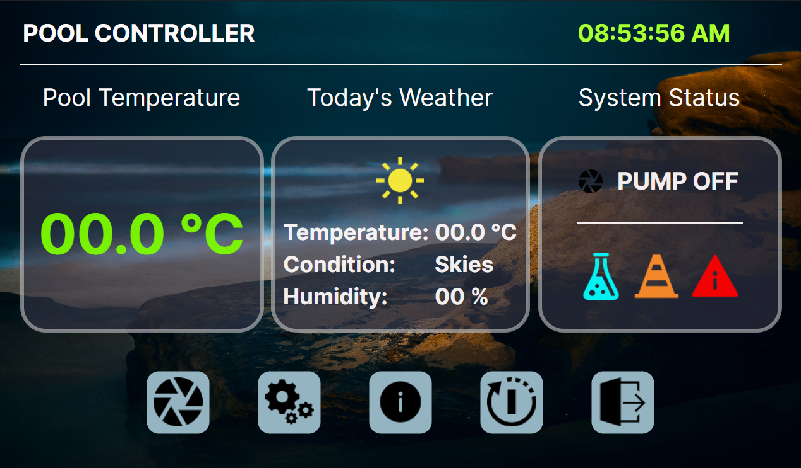
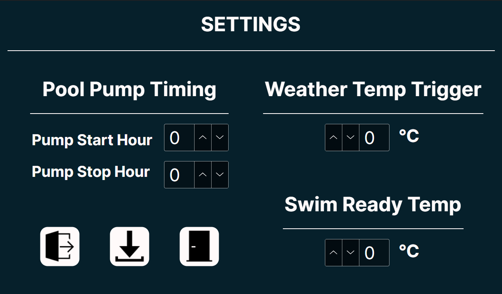


# Pool Pump Controller
### SBC Based Swimming Pool Pump Controller. <hr/>

This Project controls your swimming Pool Pump autonomously, via a Raspberry Pi SBC.

#### Features: <br/>
+ Check and Display Current Pool Temp + Change Colour.
+ Control Pool Pump Timing + Based on Weather Condition.
+ Display Current Weather Data from set Location.
+ Has Bypass Control.
+ Just Being Cool - This Project is Obviously an "Overkill of this type of project." 😆
<hr/>

## Preview:




<hr/>

## How to Install: <br/>
### 1. Install and flash a Raspberry Pi 3, 4, 5 With at least 1GB Ram with Raspberry Pi OS 64bit. <br/> (Username : admin)

### 2. Create an Account on OpenWeatherMap and get a free API Key.
1. Login -> https://openweathermap.org/
2. Generate a free apikey -> https://home.openweathermap.org/api_keys
3. Browse to Startup Current Weather API -> https://openweathermap.org/current
4. Take Note you need to enter your longitude and latitude:
   ```https://api.openweathermap.org/data/2.5/weather?lat={lat}&lon={lon}&appid={API key}```
5. You can find your lon lat on this site -> https://www.latlong.net/
6. Copy and paste the API key in a text folder called apikey.txt

### 3. Clone Project on Development PC.
```
git clone https://github.com/TheSloppyCoder/PoolController.git
```

### 4. Add your lon lat coordinates in the: ```src/MainWindow.axaml.cs file - GetAndDisplayWeatherData() Task 'url' ```

### 5. Check out Wiring Diagram at the bottom:
1. Wire up the Temp sensor to get the DS1820B Temp Sensor Address.
2. Take note of the Sensor Address: ```/sys/bus/w1/devices/28-xxxxx/w1_slave```
3. Update the Sensor Address in the ```src/MainWindow.axaml.cs file - CheckAndDisplayPoolTemp() Task 'sensorPath'```

### 6. Build and Deploy / Publish Project in IDE [self-contained] [linux-arm64].
1. Google or use AI to help how to publish a C# AvaloniaUI Raspberry Pi Project on Rider or Visual Studio.

### 7. Copy over Published Project to Raspberry Pi ```/home/admin/Desktop.```

### 8. Create a txt file with only the API Key in it (apikey.txt). <br/>
1. Copy the apikey.txt file to the Root Directory of the Published App on the Raspberry Pi.

### 9. Make sure to make the PoolController file - executable.
```
chmod + x /home/admin/PoolController/PoolController
```
### 10. Copy the Autostart file to the Raspberry Pi from the setup-files directory:
1. Make a Directory: ``` mkdir /home/admin/.config/autostart```
2. In the Cloned repo copy the file "PoolController.desktop" from the setup-files directory.
3. Paste the file on the Raspberry Pi in /home/admin/.config/autostart

### 11. Reboot Raspberry Pi and Test auto start of the App.
```
sudo reboot
```

<hr/>

## Hardware - Wiring Diagram (Check below Steps) :


### Wiring Steps:
1. Connect DS1820B Temp Sensor to RPI GPIO 4 (4.7K ohm Resistor).
2. Connect Relay to RPI GPIO 8.
3. Enable One Wire on the Raspberry Pi with ``` sudo raspi-config ```
4. Reboot.
5. Connect Raspberry Pi to 7" HDMI Display -> https://www.waveshare.com/7inch-hdmi-lcd-h.htm

## DONE.


